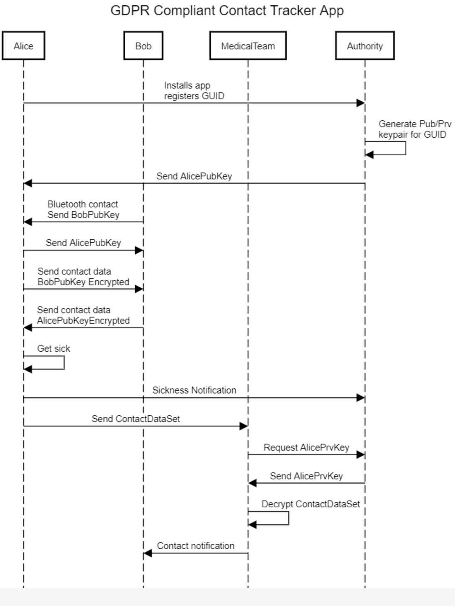

# GDPR Contact Tracker
This is a simple design for a Contact Tracing app that can be implemented very simply and that fully respects privacy.
In short the design accomplishes a private contact tracking that exposes data only on a need-to-know basis and with consent of the user. - * The authority does not have access to the data at any time and can't see any of the tracking information.
* Each user stores their contact histrory locally on their device. This data is encrypted using a public key from an assymetric encryption keypair, e.g. RSA.
* The owner of the device does not have the private key and can not access to the personal information of the people with whom they have come into contact. 
* The private key is held by the authority, who never has access to the encrypted data.
* When a person becomes sick, they notify the authority through the app. They then give their encrypted contact historyu to the Medical Team. 
* The Medical Team requests the private key from the authority, who release it because they have receieved the notification from the user.
* The Medical Team can decrypt the contact history and notify the individuals in the list.

The only people that get to see the personal details in the contact history are the medical team. They can only decrypt this after the holder of the data has given consent to the authority (sickness notification) and the authority has given the Medical Team the private key.

The contact notification does not need to tell the recipient with whom they came into contact that was infected. Users of the application remain anonymous to each other.

The contact tracking information can even be limited to the device GUID so that notification can be done via push message to the concerned app users. With this method, it is possible to have the app never expose your personal information to anyone.

In the sequence diagram below, Bob is already a registered user of the app.

The file sequencediagram.org.txt can be used to edit the sequence diagram on https://sequencediagram.org/

